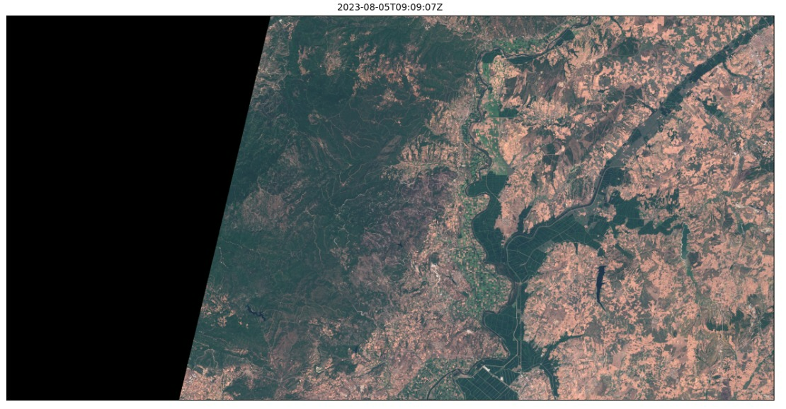
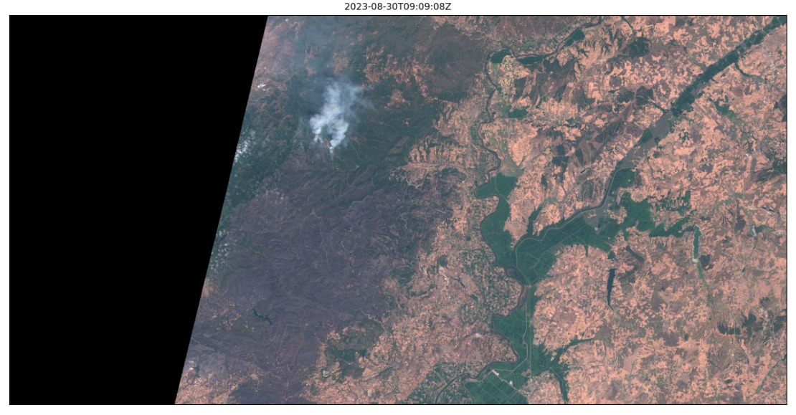

<h1 style="text-align: center"> Sentinel 2 images around Alexandroupoli (Copernicus Satellites)</h1>

_Before and after-fire plots for the north area of Alexandroupoli, Greece_

## Authors ✒️

_Paz Rotllán García | pazrotgar@gmail.com | https://github.com/pazrg/_ 

## Thanks! 🎁

* [Copernicus](https://www.copernicus.eu/)
* [SentinelHub](https://www.sentinel-hub.com/)